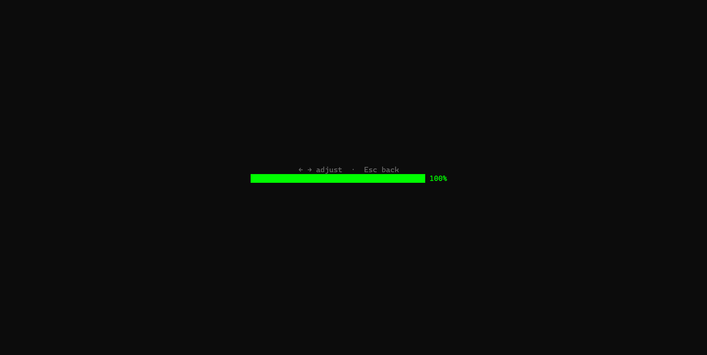
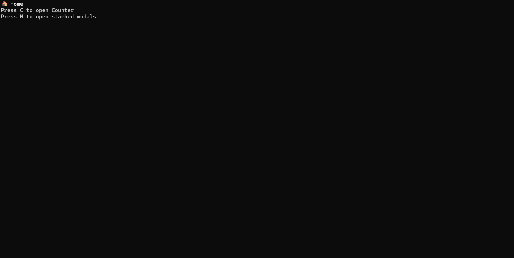

<div align="center">
        <br>
        <br>
        
        <br>
        <br>
        <br>					 
</div>

<h1 align="center">Cartridge</h1>

>A frame for rapidly building complex, multi-page, interaction-heavy terminal applications — filling the critical gaps Ink leaves open.

[](https://github.com/BAIGAOa/ink-cartridge/actions/workflows/ci.yml)
[](https://www.npmjs.com/package/ink-cartridge)
[](https://www.npmjs.com/package/@cartridge-engine/keyboard-engine)
[](https://github.com/BAIGAOa/ink-cartridge)
[](https://github.com/BAIGAOa/ink-cartridge)
[](https://opensource.org/licenses/MIT)

## Table of Contents

- [Design Philosophy](#design-philosophy)
- [Quick Start](#quick-start)
- [Installation](#installation)
- [Documentation](#documentation)
- [For AI](#for-ai)
- [Examples](#examples)
- [License](#license)

## Design Philosophy

Ink gives you `useInput` and `render`. Everything else — screen navigation, layered keyboard events, focus management, cross-component communication — you build yourself. ink-cartridge provides all of that, designed for **multi-page, interaction-dense terminal apps** where a single global `useInput` with `if-else` chains breaks down.

TWO pillars:

- **Screen as component** — Every React component is a screen. Register them into a tree, navigate with `skip` / `back` / `gotoScreen`. No hand-written conditional rendering.
- **Layered keyboard engine** — Each screen owns its key bindings. A 9-stage pipeline resolves conflicts between modals, overlays, global keys, and the screen stack. Focus system partitions keys within the same layer.


## Quick Start

```tsx
import React, { useContext, useEffect, useState } from "react";
import { Box, Text, render } from "ink";
import {
	CurrentScreen,
	KeyboardProvider,
	ModalContext,
	registerComponent,
	ScenarioManagementProvider,
	useKeyboard,
	useScreenSystem,
} from "ink-cartridge";

// ── Home ──
function Home() {
	const { skip, openModal } = useScreenSystem();
	const { boundKeyboard } = useKeyboard();

	useEffect(() => {
		const toProgress = boundKeyboard(["p"], () => skip(ProgressBar, {}));
		const modals = boundKeyboard(["m"], () => {
			openModal("low", Modal, {top: 0, left: 80}, { zIndex: 1, renderNow: true });
			openModal("high", Modal, {top: 4, left: 70}, { zIndex: 2, renderNow: true });
            openModal("high-high", Modal, {top: 8, left: 60}, { zIndex: 3, renderNow: true });
            openModal("high-high-high", Modal, {top: 10, left: 55}, { zIndex: 4, renderNow: true });
            openModal("high-high-high-high", Modal, {top: 12, left: 50}, { zIndex: 5, renderNow: true });
            openModal("high-high-high-high-high", Modal, {top: 13, left: 45}, { zIndex: 6, renderNow: true });
            openModal("high-high-high-high-high-high", Modal, {top: 12, left: 40}, { zIndex: 7, renderNow: true });
            openModal("high-high-high-high-high-high-high", Modal, {top: 11, left: 35}, { zIndex: 8, renderNow: true });
		});
		return () => {
			toProgress();
			modals();
		};
	}, [boundKeyboard]);

	return (
		<Box flexDirection="column">
			<Text bold>🏠 Home</Text>
			<Text>Press P to open Progress Bar</Text>
			<Text>Press M to open stacked modals</Text>
		</Box>
	);
}
registerComponent(Home, {});

// ── Progress Bar ──
function ProgressBar() {
	const [value, setValue] = useState(50);
	const { back } = useScreenSystem();
	const { boundKeyboard } = useKeyboard();

	useEffect(() => {
		const left = boundKeyboard(["left"], () => setValue((v) => Math.max(0, v - 5)));
		const right = boundKeyboard(["right"], () => setValue((v) => Math.min(100, v + 5)));
		const esc = boundKeyboard(["escape"], () => back());
		return () => {
			left();
			right();
			esc();
		};
	}, [boundKeyboard]);

	// Smooth color gradient: red(0) → yellow(50) → green(100)
	const r = value <= 50 ? 255 : Math.round(255 - (value - 50) * 5.1);
	const g = value <= 50 ? Math.round(value * 5.1) : 255;
	const color = `#${r.toString(16).padStart(2, "0")}${g.toString(16).padStart(2, "0")}00`;

	const filled = Math.round(value * 0.4);
	const bar = "█".repeat(filled) + "░".repeat(40 - filled);

	return (
		<Box height="100%" width="100%" justifyContent="center" alignItems="center" flexDirection="column">
			<Text dimColor>← → adjust  ·  Esc back</Text>
			<Text color={color}>{bar} {value}%</Text>
		</Box>
	);
}
registerComponent(ProgressBar, {}, { parent: Home });


function Modal({ top, left }: { top: number; left: number }) {
	const { closeModal } = useScreenSystem();
	const { boundKeyboard } = useKeyboard();
    const modal = useContext(ModalContext)

	useEffect(() => {
		return boundKeyboard(["escape"], () => {
			if (modal) {
                closeModal(modal.id)
            }
		});
	}, [boundKeyboard]);

	return (
		<Box
			position="absolute"
			top={top}
			left={left}
			borderStyle="round"
			borderColor="yellow"
			padding={1}
			backgroundColor="black"
		>
			<Text bold color="yellow">
				{"┌──────────────────────────────────────────┐\n" +
				 "│ ⚠  cartridge.exe — Application Error  X  │\n" +
				 "├──────────────────────────────────────────┤\n" +
				 "│                                          │\n" +
				 "│  Unhandled exception has occurred in     │\n" +
				 "│  your application.                       │\n" +
				 "│                                          │\n" +
				 "│  NullReferenceException:                 │\n" +
				 "│  Object reference not set to an          │\n" +
				 "│  instance of an object.                  │\n" +
				 "│                                          │\n" +
				 "│                        [  OK  ]  [Cancel]│\n" +
				 "└──────────────────────────────────────────┘"}
			</Text>
		</Box>
	);
}
registerComponent(Modal, {top: 0, left:0});

render(
	<ScenarioManagementProvider defaultScreen={Home} fullScreen>
		<KeyboardProvider>
			<CurrentScreen />
		</KeyboardProvider>
	</ScenarioManagementProvider>
);

```

<div align="center">



</div>

## Installation

```bash
npm install ink-cartridge
```

For the standalone keyboard engine (framework-agnostic):

```bash
npm install @cartridge-engine/keyboard-engine
```


## Documentation

- [ink-cartridge API docs](docs/) — keyboard, screen, event, components, theme, language, dev-tool, cli
- [keyboard-engine API docs](src/keyboard-engine/docs/API/) — standalone engine APIs (framework-agnostic)

## For AI

AI-friendly project — see [AGENTS.md](AGENTS.md) for coding conventions, [agents/rules/](agents/rules/) for conditional rules, and [docs-agents/](docs-agents/) for reference material. AI writes, humans review and sign off.

## Examples

Runnable demos for every component. See [examples/README.md](examples/README.md) for the full list and run commands.

## License

[MIT](LICENSE)
