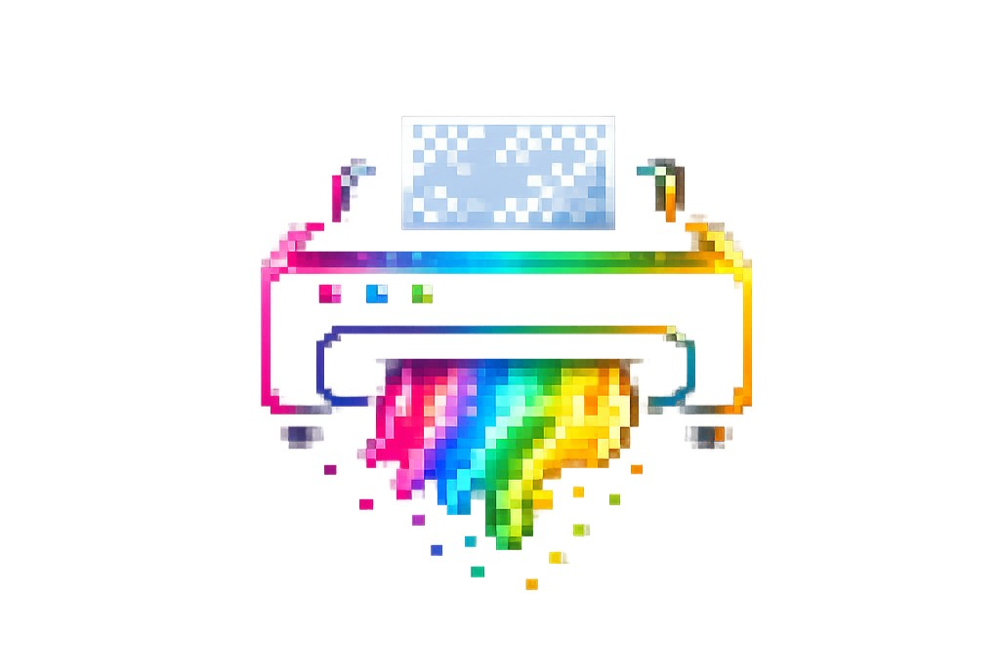

<div align="center">
        <br>
        <br>
        
        <br>
        <br>
        <br>
					 
				  <p style="font-size: 24px; font-weight: bold;">Cartridge</p>
</div>

>A component kit for rapidly building complex, multi-page, interaction-heavy terminal applications — filling the critical gaps Ink leaves open.

[](https://github.com/BAIGAOa/ink-trc/actions/workflows/ci.yml)
[](https://www.npmjs.com/package/ink-cartridge)
[](https://opensource.org/licenses/MIT)

## Table of Contents

- [Design Philosophy](#design-philosophy)
- [Installation](#installation)
- [Scaffold](#scaffold)
- [Documentation](#documentation)
- [Other](#other)
- [License](#license)

## Design Philosophy

Ink gives you `useInput` and `render`. Everything else — screen navigation, layered keyboard events, focus management, cross-component communication — you build yourself. ink-cartridge provides all of that, designed for **multi-page, interaction-dense terminal apps** where a single global `useInput` with `if-else` chains breaks down.

Three pillars:

- **Screen as component** — Every React component is a screen. Register them into a tree, navigate with `skip` / `back` / `gotoScreen`. No hand-written conditional rendering.
- **Layered keyboard engine** — Each screen owns its key bindings. A 7-stage pipeline resolves conflicts between modals, overlays, global keys, and the screen stack. Focus system partitions keys within the same layer.
- **Event bus** — Decoupled cross-component communication. Global keys emit events; any component subscribes. Zero prop drilling.

## Installation

```bash
npm install ink-cartridge
```

## Scaffold

```bash
npx ink-cartridge init my-tui
```

## Documentation

<details>
<summary><b>keyboard/</b> — Architecture &amp; API index</summary>

- [README](docs/keyboard/README.md) — Architecture &amp; API index
- [KeyboardProvider](docs/keyboard/KeyboardProvider-API.md)
- [useKeyboard](docs/keyboard/useKeyboard-API.md)
- [boundKeyboard](docs/keyboard/boundKeyboard-API.md)
- [boundSequence](docs/keyboard/boundSequence-API.md)
- [blockedKey](docs/keyboard/blockedKey-API.md)
- [stop](docs/keyboard/stop-API.md)
- [globalKeys](docs/keyboard/globalKeys-API.md)
- [globalSequence](docs/keyboard/globalSequence-API.md)
- [focus system](docs/keyboard/focus-system-API.md)
- [shortcut actions](docs/keyboard/shortcut-actions-API.md)
- [sequence actions](docs/keyboard/sequence-actions-API.md)
- [allowModal](docs/keyboard/allowModal-API.md)
- [useModalMissListener](docs/keyboard/useModalMissListener-API.md)
- [enableWildcardPriority](docs/keyboard/enableWildcardPriority-API.md)
- [advanced](docs/keyboard/advanced.md)
</details>

<details>
<summary><b>screen/</b> — Architecture &amp; API index</summary>

- [README](docs/screen/README.md) — Architecture &amp; API index
- [registerComponent](docs/screen/registerComponent-API.md)
- [ScenarioManagementProvider](docs/screen/ScenarioManagementProvider-API.md)
- [CurrentScreen](docs/screen/CurrentScreen-API.md)
- [useScreenSystem](docs/screen/useScreenSystem-API.md)
- [skip](docs/screen/skip-API.md)
- [back](docs/screen/back-API.md)
- [gotoScreen](docs/screen/gotoScreen-API.md)
- [overlay](docs/screen/overlay-API.md)
- [modal](docs/screen/modal-API.md)
- [ModalContext](docs/screen/ModalContext-API.md)
- [advanced](docs/screen/advanced.md)
</details>

<details>
<summary><b>event/</b> — Architecture &amp; API index</summary>

- [README](docs/event/README.md) — Architecture &amp; API index
- [createEventBus](docs/event/createEventBus-API.md)
- [EventProvider](docs/event/EventProvider-API.md)
- [useEmitter](docs/event/useEmitter-API.md)
- [useSubscribe](docs/event/useSubscribe-API.md)
- [useEventBus](docs/event/useEventBus-API.md)
- [EventBus](docs/event/EventBus-API.md)
- [advanced](docs/event/advanced.md)
</details>

<details>
<summary><b>components/</b> — Component index</summary>

- [README](docs/components/README.md) — Component index
- [SelectInput](docs/components/SelectInput/SelectInput-API.md)
- [SelectRow](docs/components/SelectRow/SelectRow-API.md)
- [MultiSelectInput](docs/components/MultiSelectInput/MultiSelectInput-API.md)
- [TextInput](docs/components/TextInput/TextInput-API.md)
- [UncontrolledTextInput](docs/components/TextInput/UncontrolledTextInput-API.md)
- [NumberInput](docs/components/NumberInput/NumberInput-API.md)
- [SearchInput](docs/components/SearchInput/SearchInput-API.md)
- [ConfirmDialog](docs/components/ConfirmDialog/ConfirmDialog-API.md)
- [Spinner](docs/components/Spinner/Spinner-API.md)
- [ProgressBar](docs/components/ProgressBar/ProgressBar-API.md)
- [Divider](docs/components/Divider/Divider-API.md)
- [Badge](docs/components/Badge/Badge-API.md)
- [KeyHint](docs/components/KeyHint/KeyHint-API.md)
- [Tabs](docs/components/Tabs/Tabs-API.md)
- [Fold](docs/components/Fold/Fold-API.md)
- [Form](docs/components/Form/Form-API.md)
- [Field](docs/components/Form/Field-API.md)
- [useFormContext](docs/components/Form/useFormContext-API.md)
</details>

<details>
<summary><b>theme/</b></summary>

- [README](docs/theme/README.md)
- [ThemeProvider](docs/theme/ThemeProvider-API.md)
- [useTheme](docs/theme/useTheme-API.md)
- [advanced](docs/theme/advanced.md)
</details>

<details>
<summary><b>language/</b></summary>

- [README](docs/language/README.md)
- [LanguageProvider](docs/language/LanguageProvider-API.md)
- [useI18n](docs/language/useI18n-API.md)
- [advanced](docs/language/advanced.md)
</details>

<details>
<summary><b>storage/</b></summary>

- [README](docs/storage/README.md)
- [createStorage](docs/storage/createStorage-API.md)
</details>

<details>
<summary><b>binary-storage/</b></summary>

- [README](docs/binary-storage/README.md)
- [createBinaryStorage](docs/binary-storage/createBinaryStorage-API.md)
- [createStreamingReader](docs/binary-storage/createStreamingReader-API.md)
</details>

<details>
<summary><b>dev-tool/</b></summary>

- [README](docs/dev-tool/README.md)
- [openDevTool](docs/dev-tool/openDevTool-API.md)
- [closeDevTool](docs/dev-tool/closeDevTool-API.md)
</details>

## Other

The method `blockedKey` is poorly named — it means *pass-through*, not "block." The internal name is `penetration`. Too late to rename now.

## License

[MIT](LICENSE)
