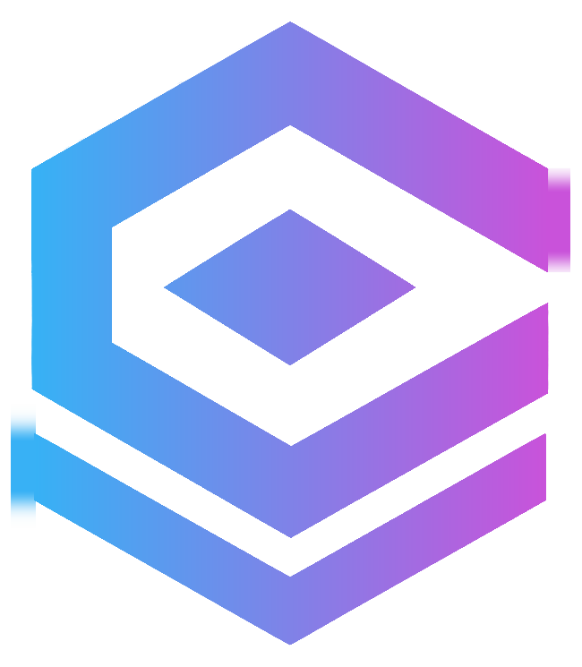
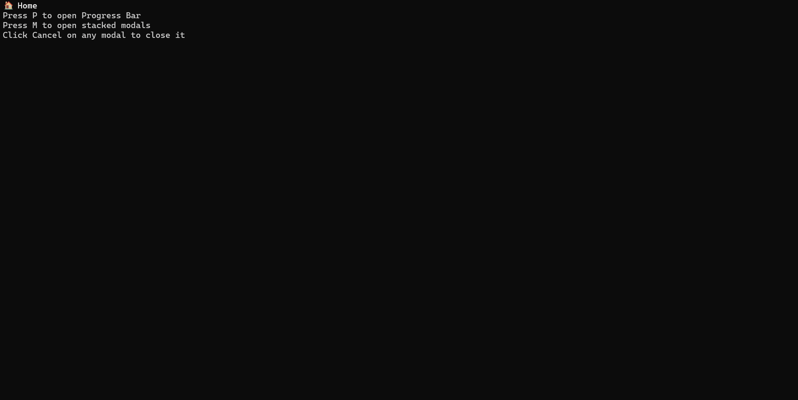
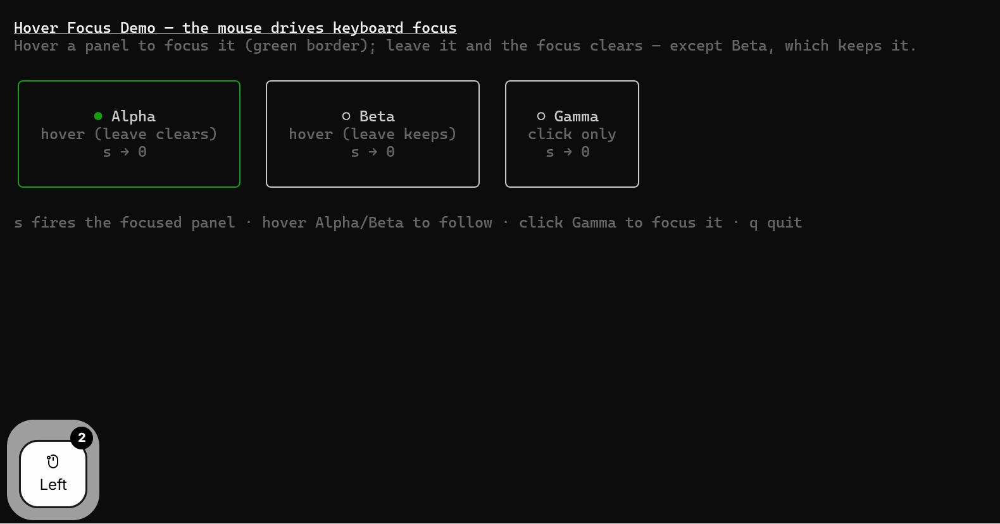
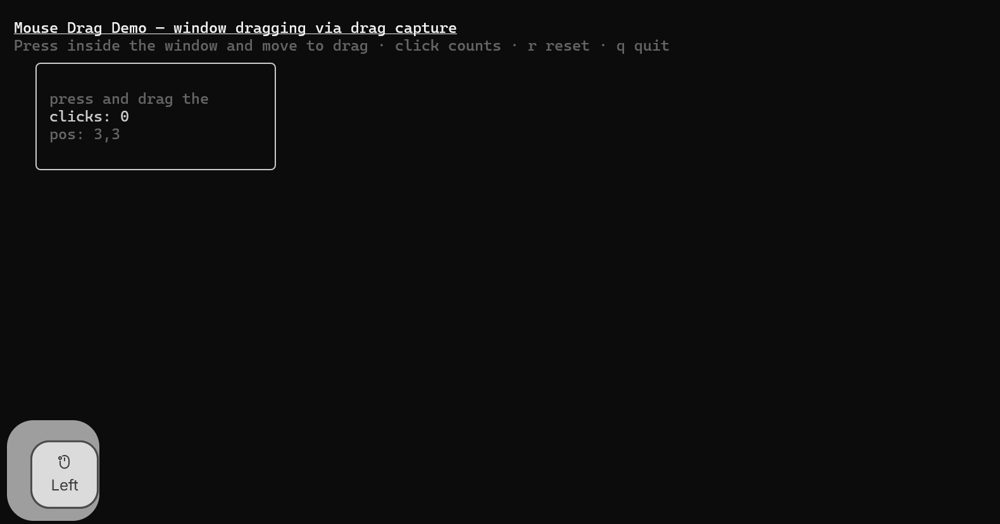

<div align="center">
        <br>
        <br>
        
        <br>
        <br>							 
</div>

>Cartridge for ink

[](https://github.com/BAIGAOa/ink-cartridge/actions/workflows/ci.yml)
[](https://www.npmjs.com/package/ink-cartridge)
[](https://www.npmjs.com/package/@cartridge-engine/keyboard-engine)
[](https://github.com/BAIGAOa/ink-cartridge)
[](https://github.com/BAIGAOa/ink-cartridge)
[](https://opensource.org/licenses/MIT)

## Table of Contents

- [Design Philosophy](#design-philosophy)
- [Quick Start](#quick-start)
- [Installation](#installation)
- [Documentation](#documentation)
- [For AI](#for-ai)
- [Examples](#examples)
- [License](#license)

## Design Philosophy

ink-cartridge aims to enhance Ink, not replace it. It makes the interaction and development experience of Ink apps more comfortable, and the apps themselves more deterministic and stable, by providing the foundational capabilities for building interaction-dense, multi-page applications.

ink-cartridge is not an all-in-one framework. Most business logic is implemented by you or composed from other libraries; ink-cartridge only provides the foundational capabilities for building complex applications.

- **Screen as component** — Any React component *can be* a screen. Register it into a tree and navigate with `skip` / `back` / `gotoScreen`. No hand-written conditional rendering.
- **Layered keyboard engine** — Each screen owns its key bindings. A 9-stage pipeline resolves conflicts between modal layers, layers, global keys, and the screen stack. The focus system partitions keys within the same layer.

> **Note:** The standalone component packages under `packages/` (`@cartridge-engine/*`) are deprecated and will no longer be maintained. A rewritten component set will replace them.


## Quick Start

```tsx
import React, { useContext, useEffect, useState } from "react";
import { Box, Text, render } from "ink";
import {
	CurrentScreen,
	KeyboardProvider,
	ModalLayerElementContext,
	registerComponent,
	ScenarioManagementProvider,
	useKeyboard,
	useMouseRegion,
	useScreenSystem,
} from "ink-cartridge";

// ── Home ──
function Home() {
	const { skip, openModalLayer, applyElementToModalLayer } = useScreenSystem();
	const { boundKeyboard } = useKeyboard();

	useEffect(() => {
		const toProgress = boundKeyboard(["p"], () => skip(ProgressBar, {}));
		const modals = boundKeyboard(["m"], () => {
			const stacked = [
				["low", 1, 0, 80],
				["high", 2, 4, 70],
				["high-high", 3, 8, 60],
				["high-high-high", 4, 10, 55],
				["high-high-high-high", 5, 12, 50],
				["high-high-high-high-high", 6, 13, 45],
				["high-high-high-high-high-high", 7, 12, 40],
				["high-high-high-high-high-high-high", 8, 11, 35],
			] as const;

			for (const [layerId, zIndex, top, left] of stacked) {
				openModalLayer(layerId, zIndex);
				applyElementToModalLayer(layerId, {
					elementId: `${layerId}-modal`,
					element: () => <Modal top={top} left={left} />,
				});
			}
		});
		return () => {
			toProgress();
			modals();
		};
	}, [boundKeyboard]);

	return (
		<Box flexDirection="column">
			<Text bold>🏠 Home</Text>
			<Text>Press P to open Progress Bar</Text>
			<Text>Press M to open stacked modals</Text>
			<Text>Click Cancel on any modal to close it</Text>
		</Box>
	);
}
registerComponent(Home, {});

// ── Progress Bar ──
function ProgressBar() {
	const [value, setValue] = useState(50);
	const { back } = useScreenSystem();
	const { boundKeyboard } = useKeyboard();

	useEffect(() => {
		const left = boundKeyboard(["left"], () => setValue((v) => Math.max(0, v - 5)));
		const right = boundKeyboard(["right"], () => setValue((v) => Math.min(100, v + 5)));
		const esc = boundKeyboard(["escape"], () => back());
		return () => {
			left();
			right();
			esc();
		};
	}, [boundKeyboard]);

	// Smooth color gradient: red(0) → yellow(50) → green(100)
	const r = value <= 50 ? 255 : Math.round(255 - (value - 50) * 5.1);
	const g = value <= 50 ? Math.round(value * 5.1) : 255;
	const color = `#${r.toString(16).padStart(2, "0")}${g.toString(16).padStart(2, "0")}00`;

	const filled = Math.round(value * 0.4);
	const bar = "█".repeat(filled) + "░".repeat(40 - filled);

	return (
		<Box height="100%" width="100%" justifyContent="center" alignItems="center" flexDirection="column">
			<Text dimColor>← → adjust  ·  Esc back</Text>
			<Text color={color}>{bar} {value}%</Text>
		</Box>
	);
}
registerComponent(ProgressBar, {}, { parent: Home });


function Modal({ top, left }: { top: number; left: number }) {
	const { closeModalLayer } = useScreenSystem();
	const { boundKeyboard } = useKeyboard();
	const modalCtx = useContext(ModalLayerElementContext);
	const layerId = modalCtx?.modalLayer.layerId;

	useEffect(() => {
		if (!layerId) return;
		return boundKeyboard(["escape"], () => closeModalLayer(layerId));
	}, [boundKeyboard, closeModalLayer, layerId]);

	return (
		<Box
			position="absolute"
			top={top}
			left={left}
			width={46}
			borderStyle="round"
			borderColor="yellow"
			padding={1}
			backgroundColor="black"
			flexDirection="column"
		>
			<Text bold color="yellow">
				⚠ cartridge.exe — Application Error
			</Text>
			<Text color="yellow">  Unhandled exception has occurred in your application.</Text>
			<Text color="yellow">  </Text>
			<Text color="yellow">  NullReferenceException:</Text>
			<Text color="yellow">  Object reference not set to an instance of an object.</Text>
			<Box flexDirection="row" justifyContent="flex-end" marginTop={1}>
				{/* Click-to-close button: a child region with a higher priority
				    wins over the modal body, so only the button reacts. */}
				<ModalButton
					label="Cancel"
					onPress={() => {
						if (layerId) closeModalLayer(layerId);
					}}
				/>
			</Box>
			<Text dimColor>Esc closes · click Cancel to close</Text>
		</Box>
	);
}

// A small clickable control. `priority: 1` makes it win over any region that
// contains it (the modal body would be a priority-0 region).
function ModalButton({ label, onPress }: { label: string; onPress: () => void }) {
	const [hovered, setHovered] = useState(false);
	const ref = useMouseRegion(
		{
			onClick: onPress,
			onEnter: () => setHovered(true),
			onLeave: () => setHovered(false),
		},
		{ priority: 1 },
	);
	return (
		<Box borderStyle="round" borderColor={hovered ? "green" : "gray"} marginLeft={1} ref={ref}>
			<Text>{label}</Text>
		</Box>
	);
}

render(
	<ScenarioManagementProvider defaultScreen={Home} fullScreen>
		<KeyboardProvider mouse>
			<CurrentScreen />
		</KeyboardProvider>
	</ScenarioManagementProvider>
);

```

<div align="center">



</div>


Not only that, it also supports full coordination between mouse and keyboard focus.
This makes terminal interaction smoother. [Demo Example](./examples/xterm-mouse/MouseHoverFocus.demo.tsx)

<div align="center">

</div>

Drag: [Demo Example](./examples/xterm-mouse/MouseDrag.demo.tsx)

<div align="center">

</div>


## Installation

```bash
npm install ink-cartridge
```

For the standalone keyboard engine (framework-agnostic):

```bash
npm install @cartridge-engine/keyboard-engine
```

Standalone packages — import only what you need:

```bash
npm install @cartridge-engine/i18n @cartridge-engine/theme @cartridge-engine/event
```

| Package | Exports | CLI bin |
|---------|---------|---------|
| `@cartridge-engine/i18n` | LanguageProvider, useI18n | `make-language-type` |
| `@cartridge-engine/theme` | ThemeProvider, useTheme | `make-theme-type`, `init-theme` |
| `@cartridge-engine/event` | EventBus, EventProvider, createEventBus, useEventBus, useEmitter, useSubscribe | — |
| `@cartridge-engine/init` | project scaffold | `ink-cartridge-init` |


## Documentation

API docs are auto-published to GitHub Pages on every push to `main`:

- [ink-cartridge API docs](https://baigaoa.github.io/ink-cartridge/framework/) — screen, keyboard
- [keyboard-engine API docs](https://baigaoa.github.io/ink-cartridge/engine/) — standalone engine APIs (framework-agnostic)
- [i18n API docs](https://baigaoa.github.io/ink-cartridge/i18n/) — @cartridge-engine/i18n (LanguageProvider, useI18n)
- [theme API docs](https://baigaoa.github.io/ink-cartridge/theme/) — @cartridge-engine/theme (ThemeProvider, useTheme)
- [event API docs](https://baigaoa.github.io/ink-cartridge/event/) — @cartridge-engine/event (EventBus, EventProvider)

## For AI

AI-friendly project — see [AGENTS.md](AGENTS.md) for coding conventions, [agents/rules/](agents/rules/) for conditional rules, and [docs-agents/](docs-agents/) for reference material. AI writes, humans review and sign off.

Skills live in [`skills/`](skills/) (SKILL.md per agent tool); install them for an agent with `script/install-skill/<agent>.sh`, e.g. `script/install-skill/claude-code.sh`.

## Examples

Runnable demos for every component. See [examples/README.md](examples/README.md) for the full list and run commands.

## License

[MIT](LICENSE)
